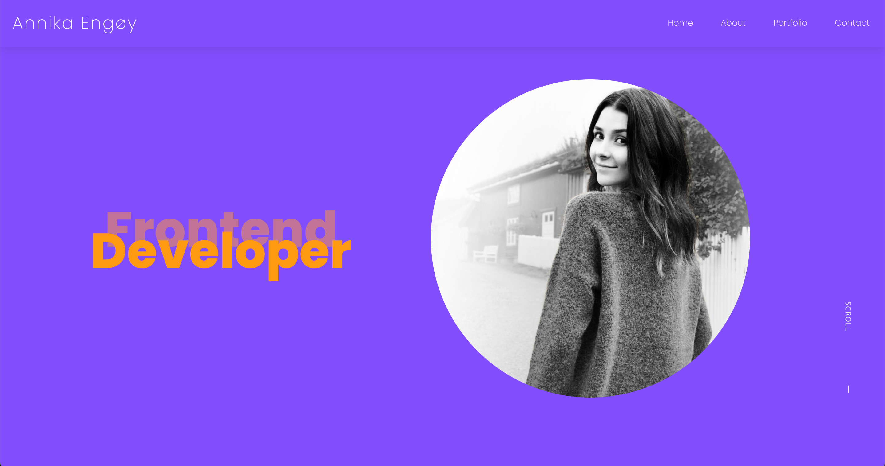

# Portfolio 2



## Description

Portfolio 2 assignment at Noroff School of Technology and Digital Media.
Documenting three prior submissions.

- Semester Project 2
- JavaScript Frameworks CA
- Project Exam 2

This page must:
List the 3 projects as cards
Each card must have:
the title of the project, a description, a screenshot of how the project looks when running, a link to the GitHub repo and a live site if it is online.

## Built With

- React JS
- React Bootstrap
- SASS

## Getting Started

### Installing

How to get started, step by step:

1. Clone the repo:

```bash
git https://github.com/Annikaenjoy/semester_project2.git
```

2. Install the dependencies:

```
npm install
```

### Running

To run the app, run the following commands:

```bash
npm run start
```

## Contributing

Thank you for taking the time to contribute!
Read the relevant section before making your contribution. It will make it a lot easier for us maintainers and smooth out the experience for all involved.

Please make sure to use open a pull request so code can be reviewed. If you don't know how, follow this step by step guide: https://opensource.com/article/19/7/create-pull-request-github

> ### Legal Notice
>
> When contributing to this project, you must agree that you have authored 100% of the content, that you have the necessary rights to the content and that the content you contribute may be provided under the project license.

## Contact

This is where you can leave your social links for people to contact you, such as a LinkedIn profile or Twitter link e.g.

[My LinkedIn page](https://www.linkedin.com/in/annika-louise-eng%C3%B8y-b1959b1a4/)

## Acknowledgments

This guide is based on the **contributing.md**. [Make your own](https://contributing.md/)!
